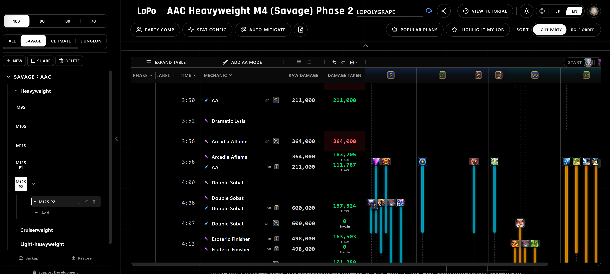
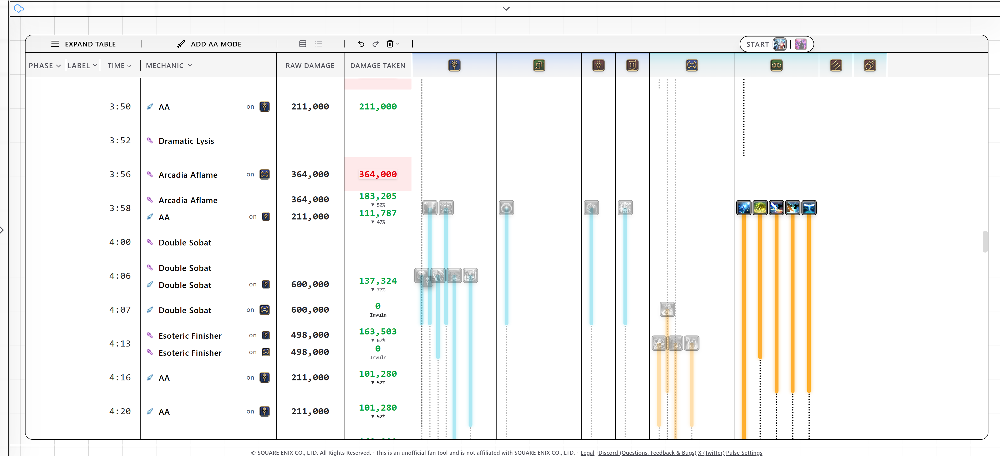
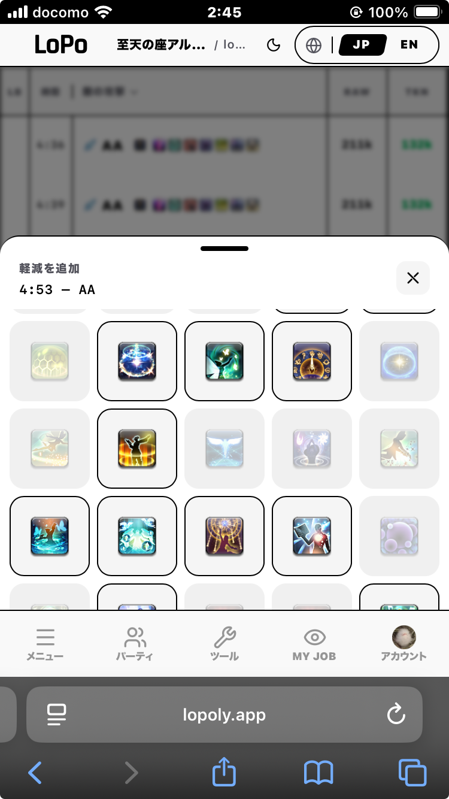

<p align="center">
  
</p>

<p align="center">
  <b>FF14便利ツール集</b><br>
  ひとりで作ってます。「これ欲しい！」を形にする個人開発プロジェクト。
</p>

<p align="center">
  <a href="https://lopoly.app">アプリ</a> &middot;
  <a href="https://discord.gg/z7uypbJSnN">Discord</a> &middot;
  <a href="https://x.com/lopoly_app">X (Twitter)</a> &middot;
  <a href="README.md">English</a>
</p>

---

## ツール

### 軽減プランナー

スプレッドシートよりもサクサク動く軽減計画ツール。タイムライン上に軽減を配置して、パーティ全体の生存をリアルタイムでシミュレートします。

<p align="center">
  <br>
  
</p>

- **タイムラインビュー** — 時系列でダメージと軽減を一覧。致死判定をリアルタイム計算
- **FFLogsインポート** — ログURLを貼るだけでタイムラインを自動生成
- **オートプランナー** — 1クリックでリキャストを考慮した軽減を自動配置
- **パーティ編成** — 8人のジョブ・ステータスを自由に設定
- **ダーク / ライト / フォーカスモード** — 好みの表示に切替
- **多言語対応** — 日本語 / English / 中文 / 한국어
- **PWA対応** — スマホでもオフラインでも快適に
- **チュートリアル** — 初めてでも操作を学べるインタラクティブガイド

<p align="center">
  
</p>

### ハウジングツアープランナー

準備中です。

---

## フィードバック・不具合報告

[Discordサーバー](https://discord.gg/z7uypbJSnN)へどうぞ！フィードバック・不具合報告お待ちしています。

---

<details>
<summary><b>開発者向けセットアップ</b></summary>

### 必要なもの

- Node.js 18+
- npm

### はじめかた

```bash
# 依存パッケージのインストール
npm install

# FFLogs APIの設定（任意）
cp .env.local.example .env.local
# .env.local にFFLogsのClient ID / Secretを記入

# 開発サーバーの起動
npm run dev
```

### ビルド

```bash
npm run build
npm run preview  # ビルド結果のプレビュー
```

### デプロイ

[Vercel](https://vercel.com)へのデプロイを想定しています。リポジトリをインポートし、環境変数に `FFLOGS_CLIENT_ID` と `FFLOGS_CLIENT_SECRET` を設定してください。

</details>

<details>
<summary><b>技術スタック</b></summary>

| カテゴリ | 技術 |
|---|---|
| フレームワーク | React 19 + TypeScript |
| ビルドツール | Vite 7 |
| 状態管理 | Zustand |
| スタイリング | Tailwind CSS 4 |
| アニメーション | Framer Motion |
| ドラッグ&ドロップ | dnd-kit |
| 国際化 | react-i18next |
| 3D背景 | Three.js |
| PWA | vite-plugin-pwa |

</details>

---

## 著作権表記

当サイトは非公式のファンツールであり、株式会社スクウェア・エニックスとは一切関係ありません。

FINAL FANTASYは株式会社スクウェア・エニックス・ホールディングスの登録商標です。

© SQUARE ENIX CO., LTD. All Rights Reserved.
